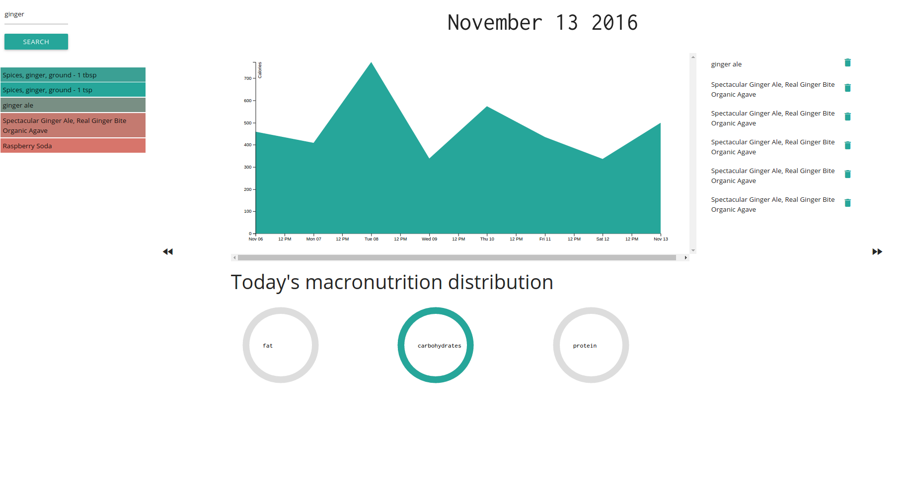

## Health Tracker



This is an optional project from the [Frontend Web Developer Nanodegree](https://www.udacity.com/course/front-end-web-developer-nanodegree--nd001) from [Udacity](https://www.udacity.com/). The application is a health tracker app that allows a user to keep track of their calorie intake. Users are able to search for specific foods using the [Nutrionix API](https://developer.nutritionix.com/) and can add selected foods to their daily intake. The total daily calorie intake is displayed for the user.

## Project specifications

Using Backbone, you will develop a single page app that tracks the user's calorie intake, and optionally, other health-related metrics. Typing food names into the search field will display a list of matching foods as provided by the health API. Users will be able to select an item from the list, and the item will be added to the list of foods the user is tracking. The total calorie count will also update to reflect the new daily total.

## What I tried to learn with this project

I wrote this project to get more acquainted with [Backbone.js](http://backbonejs.org/). Although it is a single web application I wanted to get a head start with [require.js](http://requirejs.org/). In order to improve my skills in data visualization I programmed a graphical representation of calorie intake with [d3.js](https://d3js.org/).

The rubric for this project can be found [here](https://review.udacity.com/#!/rubrics/81/view). 

## How to run locally

Install node.js, gulp and bower

```
$ npm install
$ bower install
$ npm install -g gulp
```
### For development

Serve the application with gulp:

```
$ gulp serve
```

A new tab in your browser should be opened with the following url:

```
http://localhost:3000
```

### For production

Run:

```
$ gulp
```

This will put all important files in the `dist` directory. As we wrote the project in require.js we need to use their build in optimizer. Therefore run:

```
node r.js -o build.js
```

All relevant scripts will be put into the `dist` directory. Now fire up the server:

```
gulp serve:dist
```

A new tab in your browser should be opened with the following url:

```
http://localhost:3002
```
